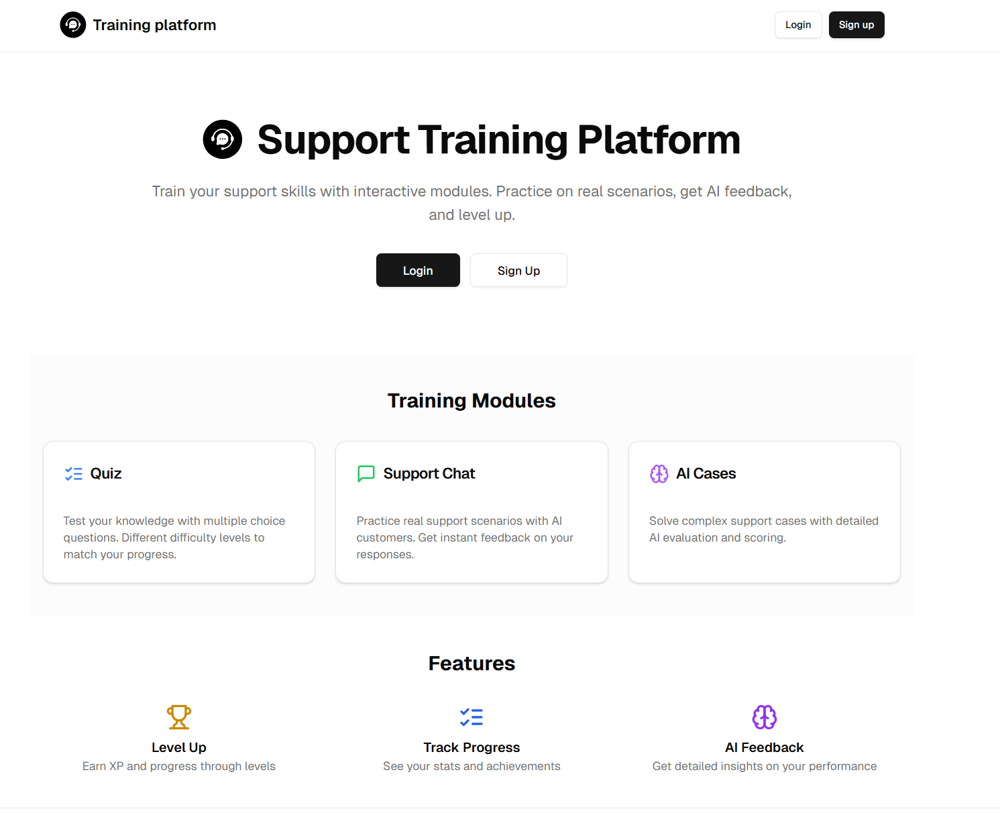
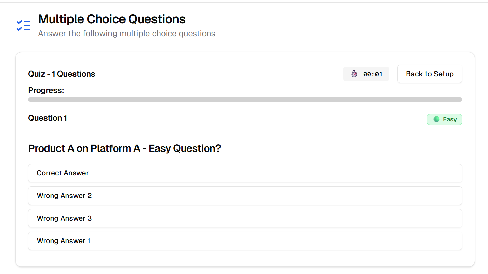
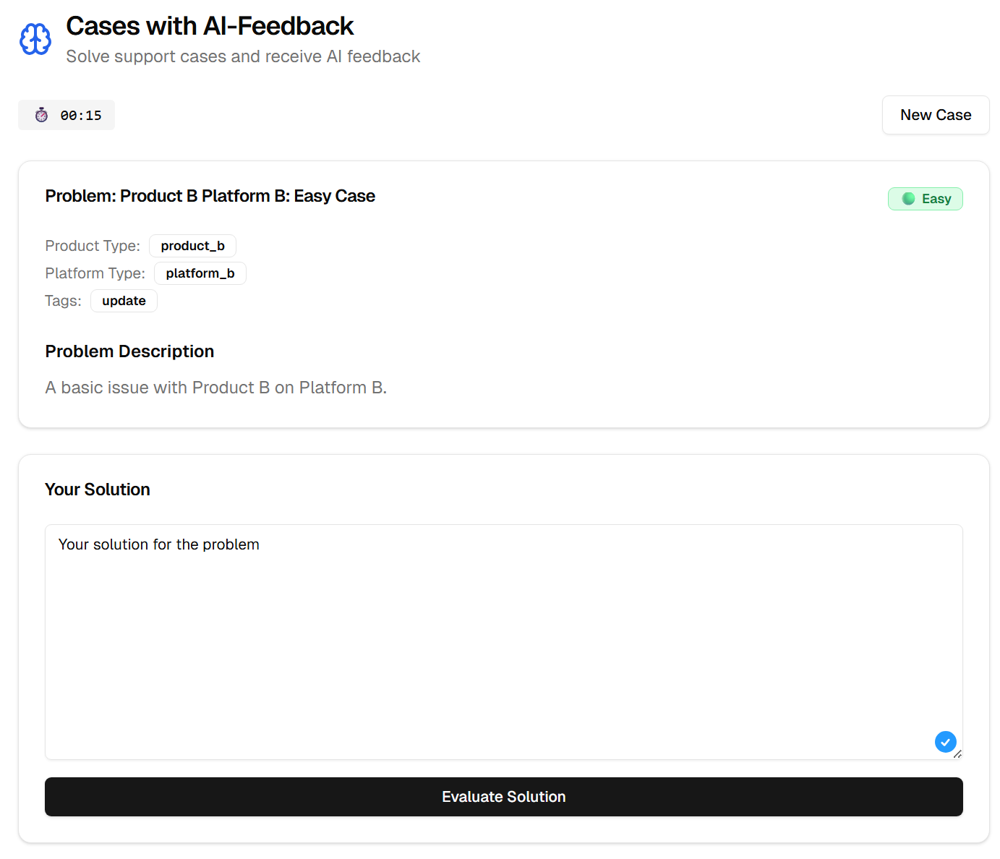
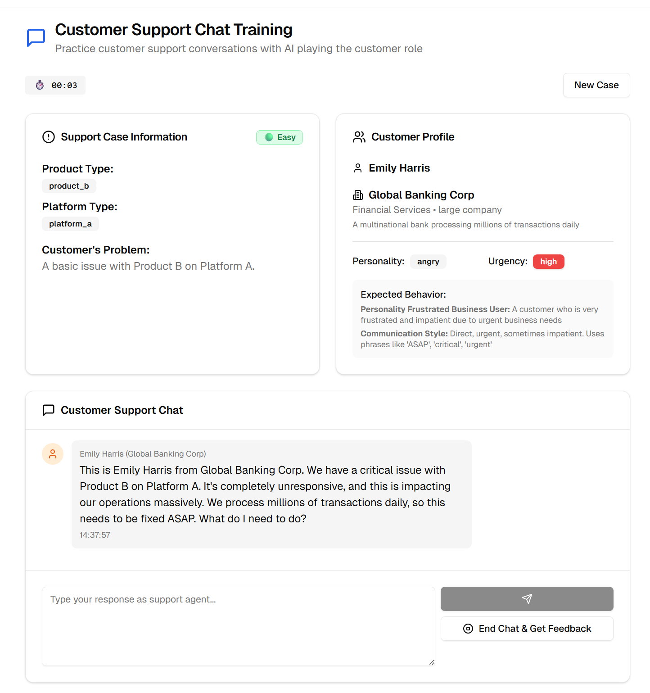
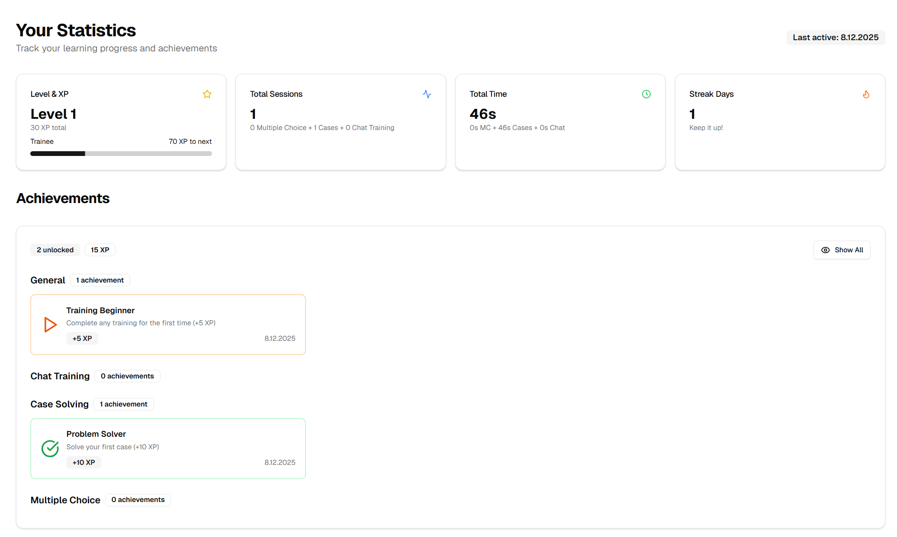
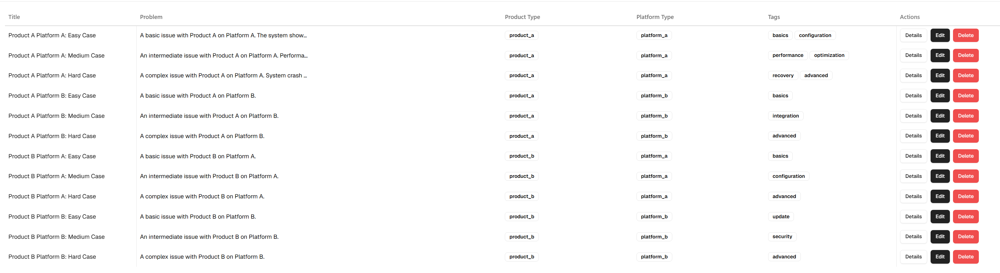

# Training Platform (Open Source Template)

A modern, AI-powered training platform built with Next.js, Supabase, and Google Gemini. This comprehensive template provides everything needed to create engaging, interactive training experiences with gamification, progress tracking, and adaptive learning paths.


---

## 📋 Quick Start Checklist

Before deploying this platform, customize these essential components:

### ✅ 1. Set Up Environment Variables

**File:** `.env.local` (copy from `.env.example`)

- [ ] Get Google Gemini API key from [Google AI Studio](https://aistudio.google.com/app/apikey)
- [ ] Configure Supabase (local or cloud - see setup sections below)

### ✅ 2. Customize Database Layout & Seed Data

**File:** `app/supabase/DATABASE_CONFIGURATION.md`

### ✅ 3. Configure Products & Platforms

**File:** `app/lib/config/app-config.ts`

- [ ] Replace `Product A`, `Product B` with your actual product names
- [ ] Replace `Platform A`, `Platform B` with your actual platform names
- [ ] Update `DIFFICULTY_LEVELS` labels if needed (Easy, Medium, Hard)

```typescript
export const PRODUCTS = {
  PRODUCT_A: { id: "product_a", label: "Your Product Name" },
  // ...
};
```

### ✅ 4. Customize AI Instructions (optional)

**Files:** `app/api/ai/Gemini/**/route.ts`

- [ ] **Chat Simulation** (`chat/route.ts`):

  - Update language preferences (default: English)
  - Customize customer personality behaviors
  - Adjust communication style guidelines

- [ ] **Case Evaluation** (`evaluate-case/route.ts`):

  - Define your evaluation criteria
  - Customize scoring methodology

- [ ] **Chat Feedback** (`chat-feedback/route.ts`):
  - Set performance metrics

Search for `systemInstruction` in these files to find all AI prompts.

### ✅ 5. Brand & Design

- [ ] Update logo in `components/layout/Logo.tsx`
- [ ] Customize theme colors in `tailwind.config.ts`
- [ ] Modify landing page content in `app/(marketing)/page.tsx`
- [ ] Update `LICENSE` copyright holder

---

## Overview

This platform combines traditional learning methods with cutting-edge AI technology to deliver an immersive training experience. It supports multiple training modalities, tracks detailed performance metrics, and uses gamification to keep learners engaged and motivated.

## Core Features

### Multiple Choice Quizzes

Interactive quizzes with intelligent question selection based on product types, platforms, and difficulty levels. Features include:

- Dynamic question pools filtered by category and difficulty
- Adaptive difficulty progression based on user level
- Real-time answer validation
- Detailed performance analytics per category
- Progress tracking across sessions



### 📋 AI-Powered Case Studies

Scenario-based learning with AI evaluation using Google Gemini:

- Real-world problem scenarios with detailed descriptions
- User submits written solution approach
- AI evaluates solution quality and provides detailed feedback
- Performance scoring (1-10) with improvement suggestions
- Custom AI instructions per case for tailored evaluation



### 💬 Chat Training

Conversational AI training that simulates real customer interactions:

- Customer persona profiles with varying difficulty levels
- Context-aware AI responses powered by Gemini
- Scored conversations based on communication quality
- Realistic scenarios across different product/platform combinations
- Detailed performance metrics (response quality, tone, professionalism)



### 📊 Comprehensive Statistics Dashboard

Track progress across all training modules with detailed insights:

- **Overall Stats:** Total sessions, completion rates, time spent
- **Performance Trends:** Progress over time with visual charts
- **Category Breakdown:** Performance by product type and platform
- **Difficulty Analysis:** Success rates across easy, medium, and hard content
- **Leaderboard:** Compare progress with other users



### 🏆 Gamification System

Keep learners motivated with XP points and achievements:

- **XP System:** Earn points for completing training sessions
- **Achievements:** Unlock badges for milestones and special accomplishments
- **Level Progression:** Advance through levels based on accumulated XP
- **Adaptive Difficulty:** Higher levels unlock harder questions and cases
  - Level < 5: Only easy difficulty available
  - Level 5-9: Easy and medium difficulty unlocked
  - Level 10+: All difficulty levels (easy, medium, hard) accessible
- **Leaderboard:** Compete with peers on the global leaderboard

**Configuration:** Difficulty unlock thresholds are defined in:

- Multiple Choice: `app/lib/multiple-choice/server/loaders/mc_questions.service.ts`
- Cases: `app/lib/cases/server/loaders/cases.service.ts`

Modify the `getAllowedDifficulties()` function to adjust level requirements.

### 🔐 Secure Authentication & User Management

Role-based access control with Supabase Auth:

- Email/password authentication
- User roles: User, Trainer, Admin
- Permission-based content access
- Secure API routes and database policies

## Training Modules Explained

### Home Dashboard

The central hub showing:

- Quick start buttons for each training module
- Recent activity summary
- Current XP level and progress to next level
- Highlighted achievements

### Cases with AI-Feedback

Work through real-world problem scenarios:

1. Read the problem description and context
2. Write your solution approach in text form
3. Submit for AI evaluation
4. Receive detailed feedback with score (1-10) and improvement suggestions

### Chat Training

Practice customer communication skills:

1. Engage in a realistic conversation
2. AI responds based on customer profile and context
3. Receive scores on communication quality
4. Review detailed feedback on your performance

### Multiple Choice

Test knowledge with adaptive quizzes:

1. Configure quiz (number of questions, filters)
2. Answer questions with instant feedback
3. See correct answers and explanations
4. Review performance statistics by category

### Your Statistics

Deep dive into your learning progress:

- Module-specific performance (MC, Cases, Chat)
- Success rates by product and platform
- Difficulty level performance analysis
- Time-based trends and patterns
- Exportable reports

### Leaderboard

Competitive rankings showing:

- Top performers by total XP
- Your current rank and XP
- User levels and achievement counts

## Training Creation (Trainers & Admins Only)

### List Cases

Browse and manage all case studies:

- View all created cases with details
- Edit or delete existing cases
- Preview case content



### Create Cases

Design new case study scenarios:

- Define problem description and solution
- Set product type and platform
- Assign difficulty level
- Write custom AI instructions for guidance
- Add relevant tags for categorization

### List Multiple Choice

Manage question banks:

- View all MC questions
- Edit or delete existing questions
- Preview question content

### Create Multiple Choice

Build new quiz questions:

- Write question text
- Define 4 answer options
- Mark correct answer
- Set product, platform, and difficulty

## Other Features

### Help Center

Access documentation and support resources:

- User guides for each module
- FAQ section
- Tips for maximizing learning
- Contact support

### Public Home

Landing page accessible without login:

- Platform overview
- Feature highlights
- Sign up / Login access

## Tech Stack

- **Framework:** Next.js 14+ (App Router)
- **Database:** Supabase (PostgreSQL)
- **Styling:** Tailwind CSS + shadcn/ui
- **AI:** Google Gemini API
- **Language:** TypeScript

## Getting Started

### Prerequisites

- Node.js 18+ or 20.x
- pnpm (recommended) or npm
- Supabase
- Google AI (Gemini) API key: Get from [Google AI Studio](https://makersuite.google.com/app/apikey)

### Installation

1. **Clone the repository**

2. **Install dependencies**

   ```bash
   pnpm install
   ```

3. **Choose your setup: Local Development or Cloud**

---

### Option A: Local Development with Supabase CLI (Recommended)

This is the easiest way to get started. No Supabase account needed!

1. **Set up environment variables**

   Copy the example file:

   ```bash
   cp .env.example .env.local
   ```

   The `.env.local` should contain:

   ```env
   # Local Supabase (default for development)
   NEXT_PUBLIC_SUPABASE_URL= URL_here
   NEXT_PUBLIC_SUPABASE_ANON_KEY= Your_Key here

   # Google Gemini AI
   GEMINI_API_KEY=your_actual_gemini_api_key
   ```

2. **Start Supabase locally**

   ```bash
   cd app
   pnpm run supabase:web:start
   ```

   This will start a local Supabase instance with PostgreSQL and all services.

3. **Reset database with migrations and seed data**

   ```bash
   pnpm run supabase:web:reset
   ```

   This creates all tables, applies migrations, and adds sample data (test users, questions, cases).

4. **Start the development server**

   ```bash
   cd ..
   pnpm dev
   ```

5. **Access the application**

   - Application: `http://localhost:3000`
   - Supabase Studio: `http://localhost:54323`
   - Test credentials: `test@example.com` / `testingpassword`

6. **Useful local development commands**

   ```bash
   # Reset database (drops all data and re-runs migrations + seed)
   pnpm run supabase:web:reset

   # Stop Supabase
   pnpm run supabase:web:stop

   # Generate TypeScript types from local database
   pnpm run supabase:web:typegen:local
   ```

---

### Option B: Cloud Deployment with Supabase Cloud

For production or if you prefer cloud hosting:

1. **Create a Supabase project**

   - Go to [supabase.com](https://supabase.com)
   - Create a new project
   - Note down your project URL and anon key

2. **Link your local project to Supabase Cloud**

   ```bash
   npx supabase login
   npx supabase link --project-ref your-project-ref
   ```

3. **Set up environment variables**

   Update `.env.local`:

   ```env
   # Supabase Cloud
   NEXT_PUBLIC_SUPABASE_URL=https://your-project.supabase.co
   NEXT_PUBLIC_SUPABASE_ANON_KEY=your_actual_anon_key

   # Google Gemini AI
   GEMINI_API_KEY=your_actual_gemini_api_key
   ```

4. **Push or reset database schema to cloud**

   ```bash
   cd app
   npx supabase db push
   ```

   ```bash
   cd app
   npx supabase db push
   ```

   ```bash
   cd app
   npx supabase db reset --linked
   ```

5. **Generate types from cloud database**

   ```bash
   pnpm run supabase:web:typegen:linked
   ```

6. **Start the development server**

   ```bash
   cd ..
   pnpm dev
   ```

---

### Customizing the Platform

1. **Update Products & Platforms**

   Edit `lib/config/app-config.ts`:

   ```typescript
   export const PRODUCTS = {
     PRODUCT_A: { id: "product_a", label: "Your Product Name" },
     PRODUCT_B: { id: "product_b", label: "Another Product" },
     OTHER: { id: "other", label: "Other" },
   };

   export const PLATFORMS = {
     PLATFORM_A: { id: "platform_a", label: "Your Platform" },
     PLATFORM_B: { id: "platform_b", label: "Another Platform" },
     OTHER: { id: "other", label: "Other" },
   };
   ```

2. **Regenerate database types** (after schema changes)

   Local:

   ```bash
   pnpm run supabase:web:typegen:local
   ```

   Cloud:

   ```bash
   pnpm run supabase:web:typegen:linked
   ```

---

## Available Commands

### Development

```bash
pnpm dev              # Start Next.js development server
pnpm build            # Build for production
pnpm start            # Start production server
pnpm lint             # Run ESLint
```

### Supabase Local

```bash
pnpm run supabase:web:start              # Start local Supabase
pnpm run supabase:web:stop               # Stop local Supabase
pnpm run supabase:web:reset              # Reset database (migrations + seed)
pnpm run supabase:web:typegen:local      # Generate types from local DB
```

### Supabase Cloud

```bash
pnpm run supabase:web:typegen:linked     # Generate types from linked cloud project
```

**Note:** Before using cloud commands, you must link your project:

```bash
npx supabase login
npx supabase link --project-ref your-project-ref
cd app && npx supabase db push
npx supabase db reset --linked
```

---

## User Roles & Permissions

The platform uses a role-based access control system with three default roles:

### Roles

- **User (default)** - Can access training modules and view personal statistics
- **Trainer** - Can create/edit/delete training content (questions, cases)
- **Admin** - Full system access including user management

### Setting User Roles

New users are assigned the **user** role by default. To grant additional permissions:

1. **Via Supabase Dashboard:**

   - Navigate to your Supabase project
   - Go to Table Editor → `accounts`
   - Find the user by email
   - Change the `role` column to `trainer` or `admin`

2. **Via SQL:**
   ```sql
   UPDATE public.accounts
   SET role = 'admin'
   WHERE email = 'user@example.com';
   ```

### Permissions by Role

| Permission     | User | Trainer | Admin |
| -------------- | ---- | ------- | ----- |
| Take Training  | ✅   | ✅      | ✅    |
| View Own Stats | ✅   | ✅      | ✅    |
| Create Content | ❌   | ✅      | ✅    |
| Edit Content   | ❌   | ✅      | ✅    |
| Delete Content | ❌   | ✅      | ✅    |
| View All Stats | ❌   | ❌      | ✅    |
| Manage Users   | ❌   | ❌      | ✅    |

**Note:** The "Permission Denied" error when accessing Training Creation means your account has the default `user` role. Contact an admin to upgrade your role to `trainer` or `admin`.

## Project Structure

```
├── app/
│   ├── api/ai/           # AI API routes (Gemini)
│   ├── auth/             # Authentication pages
│   ├── home/             # Main application pages
│   │   └── (user)/       # Protected user routes
│   │       ├── training/ # Training modules
│   │       └── statistics/ # Stats dashboard
│   ├── lib/              # App-specific utilities
│   └── supabase/         # DB migrations & config
├── components/           # React components
│   ├── ui/              # shadcn/ui components
│   └── reusable/        # Custom reusable components
├── lib/                  # Shared utilities
│   ├── config/          # App configuration
│   └── supabase/        # Supabase client & types
└── hooks/               # Custom React hooks
```

## Database Schema

The database uses PostgreSQL via Supabase with the following main tables:

- `accounts` - User profiles and settings
- `mc_questions` - Multiple choice questions
- `cases` - Case study content
- `mc_stats` / `case_stats` / `chat_stats` - User statistics
- `user_xp` - XP points and levels
- `user_achievements` - Achievement tracking

See [DATABASE_CONFIGURATION.md](./app/supabase/DATABASE_CONFIGURATION.md) for detailed schema documentation and customization instructions.

## Contributing

Contributions are welcome! Please feel free to submit a Pull Request.

## License

This project is open source and available under the [MIT License](LICENSE).

---

Originally developed as a training platform template.
